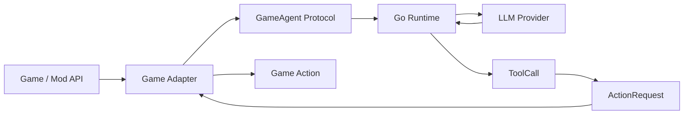

# World Is Agent

World Is Agent is a game-native agent runtime that connects real game worlds to LLM-driven agents through a protocol-first Runtime / Adapter architecture.

Stardew Valley is the first real adapter and validation environment, not the runtime boundary itself.

## Architecture At A Glance



The core boundary is intentionally small:

- Agent owns intent.
- Runtime owns cognition.
- Protocol owns contracts.
- Adapter owns translation.
- Game owns execution.

The Runtime does not import Stardew, SMAPI, or game-specific APIs. A game becomes compatible by providing an adapter that can translate its world into events, observations, capabilities, and actions.

## What Works Today

- Go Runtime over gRPC bidirectional streaming.
- Protocol v1alpha2 with explicit world and target entity routing.
- Provider-neutral model interface with Fake, DeepSeek, and OpenAI providers.
- AgentSession identity based on `game_id + world_id + entity_id`.
- Bounded multi-step AgentTurn with tool result feedback.
- Short-term memory and context projection.
- Dynamic `Capability -> Tool` registration.
- Sync tools in the Stardew adapter: `speak`, `emote`, `present_dialogue`, `face_player`.
- Async action lifecycle with `ActionStatusUpdate`, `ActionResult`, and `TurnCompletion`.
- Stardew `move_to(location, tile)` vertical slice for same-location NPC movement.
- JSONL trace output at `runtime/.local/traces.jsonl`.

## Quick Start

Prerequisites:

- Go.
- .NET SDK.
- Stardew Valley with SMAPI installed.
- An LLM API key for the configured provider.

Start the Runtime:

```powershell
cd world-is-agent
$env:DEEPSEEK_API_KEY="..."
go run ./runtime/cmd/server
```

Build and install the Stardew adapter:

```powershell
dotnet build adapters/stardew/GameAgent.Stardew.csproj
powershell -ExecutionPolicy Bypass -File scripts/install-stardew-adapter.ps1 -GamePath "D:\path\to\Stardew Valley"
```

Manual smoke test:

1. Launch Stardew Valley through `StardewModdingAPI.exe`.
2. Load a save where at least one villager NPC is reachable.
3. Click an NPC with the normal action button or mouse.
4. Check the SMAPI log for `GameEvent`, `EventAck`, `Observation`, `ActionRequest`, and `ActionResult`.
5. Check `runtime/.local/traces.jsonl` for the corresponding AgentTurn trace.

The Stardew adapter also exposes a debug command after loading a save:

```text
gameagent_probe_npc [NPC name]
```

## Configuration

- `runtime/config/model.json` configures the model provider, model name, API key environment reference, and base URL.
- `GAMEAGENT_MODEL_CONFIG` overrides the model config file path.
- `runtime/config/agent.json` configures turn timeout, LLM timeout, observation/action budgets, memory limits, and tool execution budgets.

Do not write real API keys into config files. Use `env:VARIABLE_NAME` references, such as `env:DEEPSEEK_API_KEY`.

## Repository Layout

```text
runtime/     Go agent runtime, gateway, loop, scheduler, memory, trace
protocol/    protobuf contract and generated Go/C# bindings
adapters/    game-specific adapters; Stardew is the first one
docs/        architecture baseline, roadmap, phase plans, acceptance records
scripts/     local checks and Stardew adapter install helper
```

## Development Checks

Common checks:

```powershell
go test ./runtime/... ./protocol/gen/go/...
powershell -ExecutionPolicy Bypass -File protocol/tests/check-protocol-static.ps1
powershell -ExecutionPolicy Bypass -File protocol/tests/check-go-generation.ps1
dotnet test adapters/stardew/tests/ProtocolMapper.Tests/ProtocolMapper.Tests.csproj
dotnet test adapters/stardew/tests/ActionCancellationRegistry.Tests/ActionCancellationRegistry.Tests.csproj
dotnet test adapters/stardew/tests/PlayerInteractProbe.Tests/PlayerInteractProbe.Tests.csproj
dotnet build adapters/stardew/GameAgent.Stardew.csproj
```

`go test -race ./runtime/...` should be run on Linux, CI, or a Windows environment with a working 64-bit C toolchain.

## Docs Map

Some design documents are currently written in Chinese.

- [Runtime architecture baseline](<docs/summary/GameAgent Runtime 整体架构设计规范.md>)
- [Phase roadmap](<docs/summary/GameAgent Phase3-Phase8 阶段规划.md>)
- [Multi-game compatibility and agent binding decision](<docs/summary/GameAgent 多游戏兼容性与 Agent Binding 决策.md>)
- [Phase6 async action protocol ADR](<docs/phase6/GameAgent MVP0 Phase6 Async Action Protocol Strategy ADR.md>)
- [Phase6.5 Stardew dialogue convergence plan](<docs/phase6.5/GameAgent MVP0 Phase6.5 技术开发与验收方案.md>)
- [Stardew adapter README](adapters/stardew/README.md)

## Status And Roadmap

Current status: MVP0 active development. Phase1-5.6 are accepted; Phase6 implementation is complete; Phase6.5 is being planned for Stardew dialogue convergence.

Next major areas:

- Phase7: environment recovery, reconnect behavior, and persistent agent state.
- Phase8: scenario evaluation, developer experience, packaging, and new adapter contract tests.

## License

MIT.
