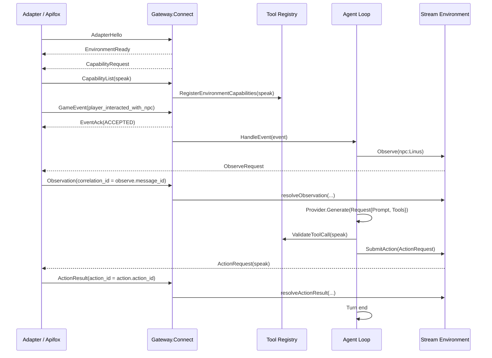

# GameAgent Runtime MVP0 Apifox One-Turn 链路记录

## 当前阶段目标

本阶段验证的是 Runtime 作为 gRPC Server，Adapter 作为 gRPC Client，通过双向流完成一次最小 Agent Turn：

Adapter 建立连接 -> Runtime 获取能力列表 -> Adapter 发送游戏事件 -> Runtime 请求观察环境 -> Runtime 生成动作 -> Adapter 返回动作执行结果。

当前模型 Provider 仍是 FakeProvider，能力只注册 `speak`。

## 核心链路



## Apifox 手动测试流程

### 1. 建立双向流

连接 Runtime gRPC 服务：

```text
127.0.0.1:50051
```

调用：

```text
GameAgentGateway.Connect
```

Apifox 侧先发送 `AdapterHello`。

Runtime 会连续返回两条消息：

```json
{
  "message_id": "runtime_ready_...",
  "environment_ready": {
    "session_id": "session:test"
  }
}
```

```json
{
  "message_id": "cap_req_...",
  "capability_request": {}
}
```

### 2. 返回能力列表

Adapter / Apifox 需要把 `CapabilityList` 的 `correlation_id` 填成上一步 `CapabilityRequest.message_id`：

```json
{
  "message_id": "capabilities_msg_1",
  "correlation_id": "cap_req_...",
  "capabilities": {
    "capabilities": [
      {
        "name": "speak",
        "version": "0.1.0",
        "description": "Make the NPC speak.",
        "input_schema_json": "{\"type\":\"object\",\"properties\":{\"text\":{\"type\":\"string\"}},\"required\":[\"text\"]}",
        "execution_mode": "EXECUTION_MODE_SYNC"
      }
    ],
    "revision": "1"
  }
}
```

当前 Runtime 收到后只注册能力，不额外返回 ack。

### 3. 发送游戏事件

Apifox 里字段建议使用 `snake_case`：

```json
{
  "message_id": "event_msg_1",
  "event": {
    "event_id": "event_1",
    "event_type": "player_interacted_with_npc",
    "entities": [
      {
        "entity_id": "player:local",
        "entity_type": "player",
        "display_name": "Player"
      },
      {
        "entity_id": "npc:Linus",
        "entity_type": "npc",
        "display_name": "Linus"
      }
    ],
    "game_time": {
      "year": 1,
      "season": 1,
      "day": 3,
      "hour": 14,
      "minute": 20
    },
    "payload": {
      "source": "apifox"
    },
    "sequence": "1"
  }
}
```

Runtime 会先返回事件确认：

```json
{
  "message_id": "event_ack_...",
  "correlation_id": "event_msg_1",
  "event_ack": {
    "event_id": "event_1",
    "status": "EVENT_ACK_STATUS_ACCEPTED"
  }
}
```

然后 Runtime 会主动请求观察 NPC：

```json
{
  "message_id": "observe_...",
  "observe": {
    "entity_id": "npc:Linus"
  }
}
```

### 4. 返回 Observation

Adapter / Apifox 需要把 `Observation` 的 `correlation_id` 填成 `ObserveRequest.message_id`：

```json
{
  "message_id": "observation_msg_1",
  "correlation_id": "observe_...",
  "observation": {
    "entity_id": "npc:Linus",
    "revision": "1",
    "state": {
      "weather": "snow",
      "location": "mountain",
      "mood": "calm"
    }
  }
}
```

Runtime 收到 Observation 后，Agent Loop 会构造模型请求：

```text
Request{
  Prompt: observation + event context,
  Tools: registered tools
}
```

FakeProvider 当前固定返回：

```text
speak({ "text": "Hello from GameAgent Runtime by zlc" })
```

### 5. 接收 ActionRequest

Runtime 会向 Adapter 发送动作请求：

```json
{
  "message_id": "action_...",
  "action": {
    "action_id": "act_...",
    "entity_id": "npc:Linus",
    "capability": "speak",
    "arguments": {
      "fields": {
        "text": {
          "stringValue": "Hello from GameAgent Runtime by zlc"
        }
      }
    }
  }
}
```

这里 `message_id` 是这条 RuntimeMessage 的消息 ID，`action_id` 是一次游戏动作调用的业务 ID。

### 6. 返回 ActionResult

Adapter / Apifox 需要把 `ActionResult.action_id` 填成上一步 `ActionRequest.action.action_id`：

```json
{
  "message_id": "action_result_msg_1",
  "action_result": {
    "action_id": "act_...",
    "status": "ACTION_STATUS_SUCCEEDED",
    "output": {
      "displayed_text": "Hello from GameAgent Runtime by zlc"
    }
  }
}
```

当前 Runtime 收到后会结束这一轮 Agent Turn，不再额外返回 ack，继续等待下一条 GameEvent。

## ID 语义

`message_id`：每一条协议消息自己的 ID，例如 `cap_req_...`、`observe_...`、`action_...`。

`correlation_id`：回复某条请求时，指向原请求的 `message_id`，例如 Observation 回复 ObserveRequest。

`action_id`：一次游戏动作的业务 ID，由 Runtime 创建，用来把 ActionRequest 和 ActionResult 对齐。

如果后续需要表达“一次完整 Agent Turn”，建议新增 `turn_id` 或 `trace_id`，不要复用 `message_id` 或 `action_id`。

## 当前阶段成果

- Runtime gRPC Server 可以监听 `127.0.0.1:50051`。
- `Connect` 已支持连接握手、Runtime Ready、能力发现、事件接收、观察请求、动作提交。
- Tool Registry 已能根据 Adapter 返回的 CapabilityList 注册 `speak`。
- Agent Loop 已能完成一次最小链路：GameEvent -> Observe -> Model Generate -> Validate ToolCall -> SubmitAction -> ActionResult。
- `streamEnvironment` 已把双向流上的异步消息包装成 `Observe(ctx, entityID)` 和 `SubmitAction(ctx, req)` 这种同步接口。
- Apifox 已手动跑通完整 one-turn 链路。
- Go fake adapter integration test 已覆盖同一条链路，并输出可读 timeline。

## 当前限制

- Provider 还是 FakeProvider，没有接真实 LLM。
- Adapter 仍由 Apifox / Go fake adapter 模拟，没有接入真实游戏。
- `CapabilityList`、`ActionResult` 当前没有额外 ack。
- 当前只支持 `player_interacted_with_npc` 事件和 `speak` 能力。
- `game_time` 当前会透传在事件里，但 Agent Loop 暂时没有使用它。

## 下一步

下一阶段可以开始开发真实 Adapter：

1. 用游戏侧代码建立到 Runtime 的 gRPC 双向流。
2. 启动后发送 `AdapterHello`。
3. 响应 `CapabilityRequest`，返回 `speak` 等能力。
4. 游戏内发生交互时发送 `GameEvent`。
5. 收到 `ObserveRequest` 后采集游戏状态并返回 `Observation`。
6. 收到 `ActionRequest` 后执行游戏动作，并返回 `ActionResult`。
